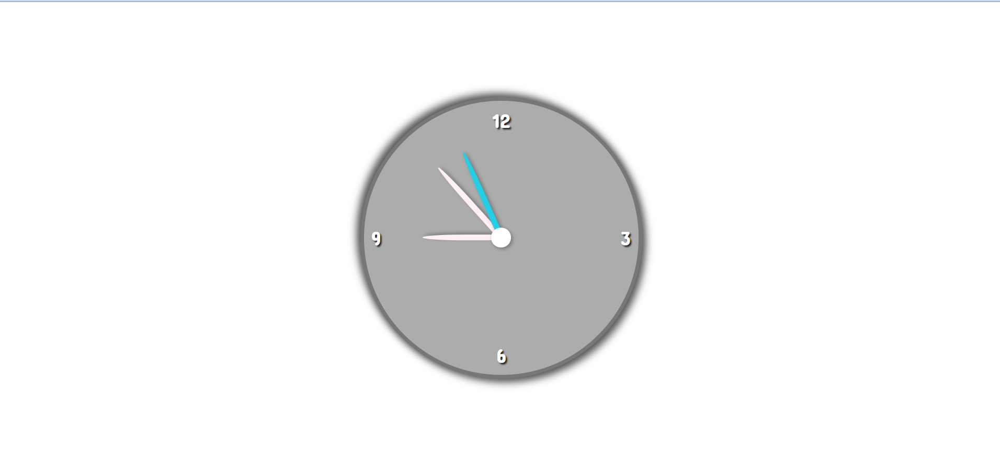

# html_clock

## Description
This project is a clock created using HTM, CSS, and JavaScript.  The clock is created using HTML and styled with CSS. JavaScript is used to get the time from the Date function.  The seconds, minutes, and hours are stripped from this function and used to calculate the position of the equivalent clock hand.  A setInterval method is used to call the setDate function every second and this will update the positon of the clock hands in real time.

## Demo
A demo of the project can be found here: https://tod619.github.io/html_clock/